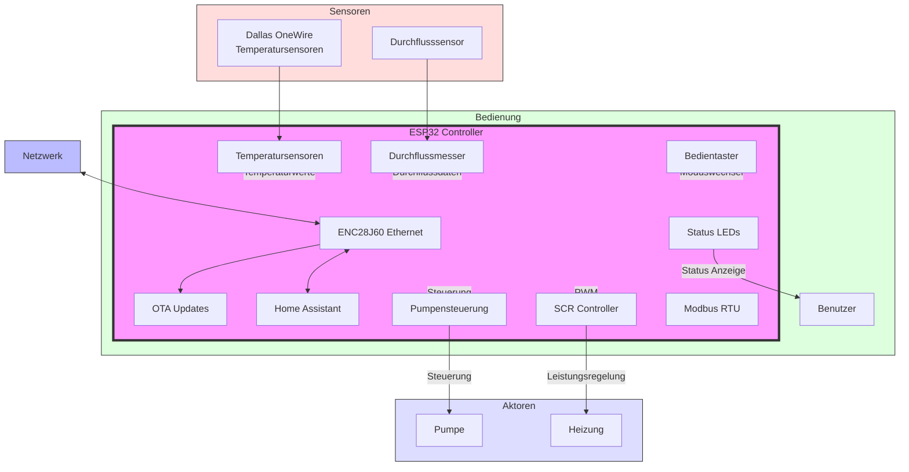

# PVHeating

## Beschreibung
PVHeating ist ein intelligentes Steuerungssystem für Heizungsanlagen in Kombination mit Photovoltaik-Systemen. Das Projekt wurde für ESP32-basierte Hardware entwickelt und optimiert den Eigenverbrauch von Solarenergie durch dynamische Heizungssteuerung.

## ⚠️ Haftungsausschluss

Die Nutzung dieser Software und der zugehörigen Hardware-Implementierung erfolgt auf eigene Gefahr. WARNUNG: Arbeiten an elektrischen Anlagen können lebensgefährlich sein! Der Autor übernimmt keine Haftung für Personen-, Sach- oder Vermögensschäden, die durch die Nutzung dieser Software oder der damit verbundenen Informationen entstehen. Jeder Anwender ist für die sichere Installation und den ordnungsgemäßen Betrieb selbst verantwortlich. Sämtliche Arbeiten dürfen nur von qualifizierten Fachkräften unter Beachtung aller geltenden Vorschriften durchgeführt werden.

## Hardware
- ESP32 (AZ-Delivery DevKit v4)
- ENC28J60 Ethernet-Modul
- Dallas OneWire Temperatursensoren
- Modbus RTU Schnittstelle
- SCR (Silicon Controlled Rectifier) für Heizungssteuerung
- Durchflussmesser
- Status-LEDs und Bedientaster

## Hauptfunktionen
- Ethernet-Konnektivität mit automatischer Reconnect-Funktion
- OTA (Over-the-Air) Updates via ElegantOTA
- Home Assistant Integration
- Modbus RTU Kommunikation
- Temperaturüberwachung via Dallas Sensoren
- Intelligente Pumpensteuerung
- LED-Statusanzeige
- Mehrere Betriebsmodi über Taster wählbar

## Voraussetzungen
- PlatformIO IDE
- VS Code oder CLion
- Git (optional)

## Installation

1. Projekt klonen oder herunterladen:

2. Projekt in PlatformIO öffnen

3. Abhängigkeiten werden automatisch installiert (definiert in platformio.ini):
    - EthernetESP32
    - ElegantOTA
    - Home Assistant Integration
    - DFRobot_RTU
    - OneWire
    - DallasTemperature
    - OneButton
    - LEDFader
    - SimpleTimer
    - FlowMeter

4. Projekt compilieren und hochladen

## Pin-Belegung
- **Ethernet**
    - CS: GPIO5
    - SCK: GPIO18
    - MISO: GPIO19
    - MOSI: GPIO23

- **Modbus**
    - TX: GPIO17
    - RX: GPIO16
    - RE: GPIO4

- **Sensoren & Steuerung**
    - OneWire: GPIO2
    - Durchfluss: GPIO39
    - Pumpe: GPIO13
    - SCR Enable: GPIO4
    - SCR PWM: GPIO26

- **Bedienelemente**
    - Fehler-LED: GPIO32
    - Fehler-Taster: GPIO34
    - Modus-LED: GPIO33
    - Modus-Taster: GPIO35

## Konfiguration
Die Grundkonfiguration erfolgt in der `platformio.ini`. Hier können Sie:
- Board-Typ ändern
- Bibliotheken hinzufügen/entfernen
- Build-Flags setzen
- Upload-Einstellungen anpassen

## OTA Updates
Das System unterstützt Over-the-Air Updates über den integrierten Webserver. Zugriff erfolgt über: http://[IP-Adresse]/update

