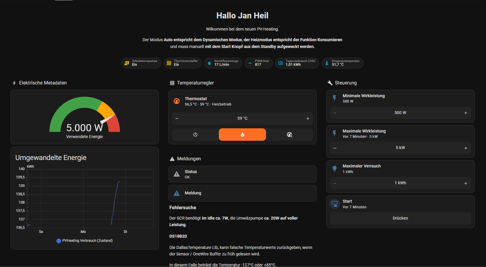
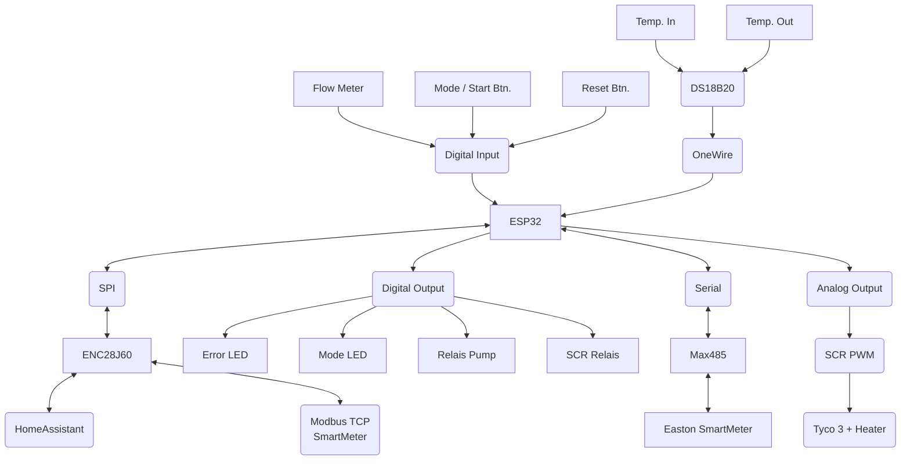

# PVHeating

## Beschreibung

PVHeating ist ein intelligentes Steuerungssystem für Heizungsanlagen in Kombination mit Photovoltaik-Systemen. Das
Projekt wurde für ESP32-basierte Hardware entwickelt und optimiert den Eigenverbrauch von Solarenergie durch dynamische
Heizungssteuerung.

## ⚠️ Haftungsausschluss

Die Nutzung dieser Software und der zugehörigen Hardware-Implementierung erfolgt auf eigene Gefahr. WARNUNG: Arbeiten an
elektrischen Anlagen können lebensgefährlich sein! Der Autor übernimmt keine Haftung für Personen-, Sach- oder
Vermögensschäden, die durch die Nutzung dieser Software oder der damit verbundenen Informationen entstehen. Jeder
Anwender ist für die sichere Installation und den ordnungsgemäßen Betrieb selbst verantwortlich. Sämtliche Arbeiten
dürfen nur von qualifizierten Fachkräften unter Beachtung aller geltenden Vorschriften durchgeführt werden.

## Hardware

- ESP32 (AZ-Delivery DevKit v4)
- ENC28J60 Ethernet-Modul
- Dallas OneWire Temperatursensoren (DS18B20)
- Modbus RTU Schnittstelle (Max 485)
- SCR (Silicon Controlled Rectifier) für Heizungssteuerung (Tyco 3)
-

Durchflussmesser [YFB5](https://github.com/Gamer08YT/FlowSensor-Arduino/blob/2d238f10bb0df1d9aced42f86a5f5e600b737310/src/FlowSensor_Type.h#L17C1-L17C17)

- Status-LEDs und Bedientaster

## Hauptfunktionen

- Ethernet-Konnektivität mit automatischer Reconnect-Funktion
- OTA (Over-the-Air) Updates via ElegantOTA
- Home Assistant Integration
- Modbus RTU Kommunikation
- Temperaturüberwachung via Dallas Sensoren
- Intelligente Pumpensteuerung
- LED-Statusanzeige
- Mehrere Betriebsmodi über Taster wählbar

## Voraussetzungen

- PlatformIO IDE
- VS Code oder CLion
- Git (optional)

## Dashboard

Das HomeAssistant Dashboard Template befindet sich unter [
homeassistant-dashboard.yml](https://github.com/Gamer08YT/PVHeating/blob/master/homeassistant-dashboard.yml)

## Bekannte Probleme

In meinem Projekt nutze ich den ENC28J60 Ethernet Treiber, leider gibt es Verbindungsprobleme mit der EthernetESP32 Lib,
dies ist aber die einzige funktionierende Lib die ich gefunden habe im Zusammenhang mit dem ENC28J60.

Als Workarround prüfe ich die Verbindung zum MQTT Broker und starte die Ethernet Verbindung nach 2 Versuchen neu, leider
hatte ich keine IOs mehr frei um meinen JTAG Adapter anzuschließen.

## Installation

1. Projekt klonen oder herunterladen:

2. Projekt in PlatformIO öffnen

3. Abhängigkeiten werden automatisch installiert (definiert in platformio.ini):
    - EthernetESP32
    - ElegantOTA
    - ArduinoHA
    - eModbus
    - OneWire
    - DallasTemperature
    - OneButton
    - ~~LEDFader~~
    - SimpleTimer
    - FlowSensor
    - ~~WebSerial~~

4. Projekt compilieren und hochladen

## Pin-Belegung

- **Ethernet**
    - CS: GPIO5
    - SCK: GPIO18
    - MISO: GPIO19
    - MOSI: GPIO23

- **Modbus**
    - TX: GPIO17
    - RX: GPIO16
    - RE: GPIO4

- **Sensoren & Steuerung**
    - OneWire: GPIO2
    - Durchfluss: GPIO39
    - Pumpe: GPIO13
    - SCR Enable: GPIO4
    - SCR PWM: GPIO26

- **Bedienelemente**
    - Fehler-LED: GPIO32
    - Fehler-Taster: GPIO34
    - Modus-LED: GPIO33
    - Modus-Taster: GPIO35

## Konfiguration

Die Grundkonfiguration erfolgt in der `platformio.ini`. Hier können Sie:

- Board-Typ ändern
- Bibliotheken hinzufügen/entfernen
- Build-Flags setzen
- Upload-Einstellungen anpassen

## OTA Updates

Das System unterstützt Over-the-Air Updates über den integrierten Webserver. Zugriff erfolgt über: http://[IP-Adresse]
/update

## Sonstiges

## Debug

Da der ESP32 mehr oder weniger aktuell nur über JTAG gedebugt werden kann (ganz anders als beim ESP8266), habe ich
versucht meine eigene Methode zu implementieren.

Dafür habe ich die handleHeap() Methode in der Main geschrieben.

Mit ``pio device monitor`` oder `` pio debug --interface=gdb`` kann man dem Seriellen Monitor attachen und mit

``C:\Users\<User>\.platformio\packages\toolchain-xtensa-esp32\bin\xtensa-esp32-elf-addr2line.exe -pfiaC -e .pio\build\az-delivery-devkit-v4\firmware.elf 0x400d12ab 0x400d2345``
bspw. das Exception Analysieren.

Andernfalls kann ich https://esphome.github.io/esp-stacktrace-decoder/ sehr empfehlen.